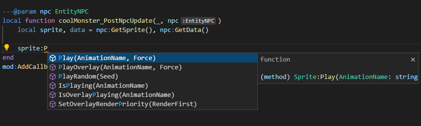

# Isaac Modding API Autocomplete

*Tired of having to go to the [docs](https://wofsauge.github.io/IsaacDocs/rep/) every time you want to mod any small thing? Of having to run the whole game to find out if you made an error that would have been immediately visible in the editor in any other language? Or just want an autocomplete that isn't "here's every single function name I found in the mod folder"? Then this might help you.*



This repo includes [EmmyLUA annotations](https://emmylua.github.io/annotation.html) for the various classes and globals included in the Binding of Isaac Repentance modding API. These tags are used by various code editors to make the autocomplete work.


## How to use

This was tested with VSCode using the [vscode-lua](https://github.com/sumneko/vscode-lua) ([annotation documentation here](https://github.com/sumneko/lua-language-server/wiki/EmmyLua-Annotations)) extension by sumneko, which includes support for EmmyLUA annotations. Other editors that support them may work.

1. First, download/clone the repo in the folder you open as your VSCode project. This might be your mod's folder, the folder containing all mods, or something else.  
    For example, this is my `Documents/Isaac/projects` folder:

    

    If you put things in your mod folder, remember to take them out before releasing!

2. Then, it should already recognize global functions like `Game()` and `Isaac.xxx`. To have it work for callback parameters, you'll need to add `---@param` tags, like so:

    ```Lua
    ---@param npc EntityNPC
    ---@param intParameter integer
    ---@param source EntityRef
    local myCallbackFunction(_, npc, intParameter, source)
    ```

    Autocomplete should work with the type specifications too, so it shouldn't be too annoying. You should also do this for any other function where you want the autocomplete to work on its params.

    You can also use `---@type` for specific variables, more info on the [annotation documentation](https://github.com/sumneko/lua-language-server/wiki/EmmyLua-Annotations). Example:

    ```Lua
    ---@type ItemConfig_Item
    local item = [etc.]
    ```

3. (optional) If you want autocomplete for the enums too, you can just copy the resources/scripts/enums.lua file in your project or mod folder, like above.

4. As above, if you put the autocomplete files in your mod folder (or enums.lua), remember to remove them before publishing your mod.

## More examples


## To-do / Help Welcome

* Ought to find a way to automate it, as right now the convertdoc.py script takes text manually copypasted from the rendered wofsauge's docs. Ideally, it should read their source, so that it can be automated to update when the docs are updated.

* If anyone knows how to make a vscode extension for this, please do.
